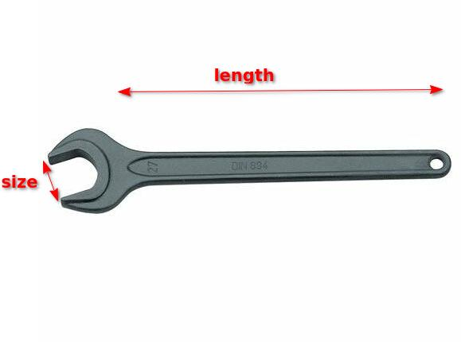

===================================
Make illegal states unrepresentable
===================================

The mantra “make illegal states unrepresentable”, popularised by `Yaron Minsky’s lecture on Effective ML <https://blog.janestreet.com/effective-ml-revisited/>`_, is a commonly used guideline to help design robust ways of “modelling” data. While it is often hard to do this perfectly, it is a very helpful technique to keep in mind.

There are many blog posts and articles about this principle, using many different programming languages. Below we’ll explore the concept using modern Python.

The example
===========

We have a system that wants to store information about physical tools, including hammers and spanners and so on. Maybe these tools will be used in a factory, maybe the program is part of code for a physical robot, maybe it’s for a game where these tools play a role.

Let’s start with a class that stores some basic information about a spanner. We’re going to use modern Python idioms, which means that we define these simple classes using `dataclasses <https://docs.python.org/3/library/dataclasses.html>`_, rather than writing a custom ``__init__`` method. So it will look like this:

.. literalinclude:: ../code/illegalstates/spanner1.py
   :language: python

(At this point, I’m not going to worry about units, or exactly what the measurements are, or whether people who are really into spanners are going to object to this. Let’s say the units are in mm and grams, and leave it at that…)

We can now make any spanner we want:

.. code-block:: python

   my_spanner = Spanner(size=10, length=150, mass=500)

We may have a whole load of code that deals with spanners - our spanner boxes etc, maybe code that shows a visualisation of each spanner etc.

Now, suppose somewhere in this system we want to know whether a specific spanner could be used with a specific nut. We’ve got some simple nut class:

.. literalinclude:: ../code/illegalstates/nuts.py
   :language: python

And we’ve got a very simple function that takes a nut and a spanner and checks they are compatible.

.. literalinclude:: ../code/illegalstates/check_spanner_nut1.py
   :language: python

(Here we’re using ``math.isclose()`` as best practice when using ``float``, rather than simple equality)

All is fine so far. But then, we realise that we have another type of spanner - adjustable spanners.

We now need to make some choices about how to adjust our code. For these spanners, the ``size`` field doesn’t really make sense any more - we instead want something like ``max_size``. We’d like to be able to write this:

.. code-block:: python

   normal_spanner = Spanner(size=10, length=150, mass=500)
   adjustable_spanner = Spanner(max_size=20, length=150, mass=500)

So we end up with a class definition where we add the ``max_size`` attribute, but make it optional. We also need to adjust the ``size`` and make that optional. Making it optional here means:

1. We add a default value of ``None`` to the field.
2. Changing the type annotation to allow ``None``

.. literalinclude:: ../code/illegalstates/spanner2.py
   :language: python

We now have
