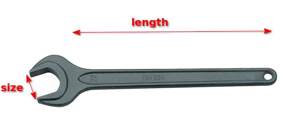
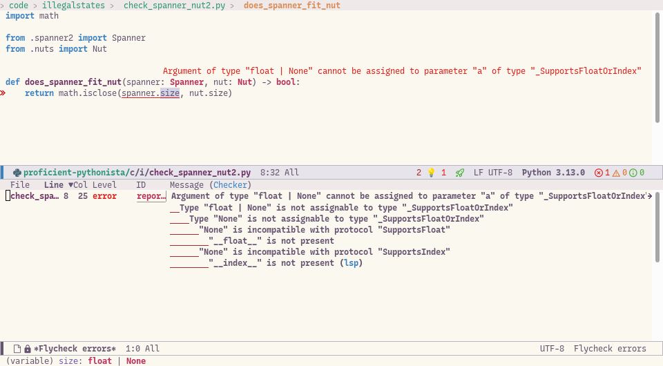

===================================
Make illegal states unrepresentable
===================================

The mantra “make illegal states unrepresentable”, popularised by `Yaron Minsky’s lecture on Effective ML <https://blog.janestreet.com/effective-ml-revisited/>`_, is a commonly used guideline to help design robust ways of “modelling” data. While it is often hard to do this perfectly, it is a very helpful technique to keep in mind.

There are many blog posts and articles about this principle, using many different programming languages. Some of these have examples that aren’t very compelling, and some almost anti-examples, and many will be confusing if you don’t know other languages. So here is my take on it, using best practice modern Python.

Before, reading see :doc:`context_and_assumptions` .

.. contents:: Contents

The example
===========

We have a system that wants to store information about physical tools, including hammers and spanners and so on. Maybe these tools will be used in a factory, maybe the program is part of code for a physical robot, maybe it’s for a game where these tools play a role.

Let’s start with a class that stores some basic information about a spanner. We’re going to use modern Python idioms, which means that we define these simple classes using `dataclasses <https://docs.python.org/3/library/dataclasses.html>`_, rather than writing a custom ``__init__`` method. So it will look like this:

.. literalinclude:: ../code/illegalstates/spanner1.py
   :language: python

(At this point, I’m not going to worry about units, or exactly what the measurements are, or whether people who are really into spanners are going to object to this. Let’s say the units are in mm and grams, and leave it at that…)

We can now make any spanner we want:

.. code-block:: python

   my_spanner = Spanner(size=10, length=150, mass=500)

We may have a whole load of code that deals with spanners - boxes that can store spanners, maybe code that shows a visualisation of each spanner etc.

Now, suppose somewhere in this system we want to know whether a specific spanner could be used with a specific nut. We’ve got some simple nut class:

.. literalinclude:: ../code/illegalstates/nuts.py
   :language: python

And we’ve got a very simple function that takes a nut and a spanner and checks they are compatible:

.. literalinclude:: ../code/illegalstates/check_spanner_nut1.py
   :language: python

(Here we’re using ``math.isclose()`` as best practice when using ``float``, rather than simple equality)

The change
==========

All is fine so far. But then, we realise that we have another type of spanner - adjustable spanners.

We now need to make some choices about how to adjust our code. For these spanners, the ``size`` field doesn’t really make sense any more – we instead want something like ``max_size``. We avoid the temptation of having a single ``size`` field and giving it two different meanings – that would be asking for trouble.

First attempt
=============

We decide that we’d like to be able to write this:

.. code-block:: python

   normal_spanner = Spanner(size=10, length=150, mass=500)
   adjustable_spanner = Spanner(max_size=20, length=150, mass=500)

So we end up with a class definition where we add the ``max_size`` attribute, but make it optional. We also need to adjust the ``size`` and make that optional too, otherwise our tools will complain. Making it optional here means:

1. We add a default value of ``None`` to the field.
2. We change the type annotation to allow ``None``

So it looks like this:

.. literalinclude:: ../code/illegalstates/spanner2.py
   :language: python

Our first problem is that we now have to adjust our ``does_spanner_fit_nut`` function. The good news is that the type checker has immediately flagged an error:

. "None" is incompatible with protocol "SupportsFloat". "__float__" is not present. "None" is incompatible with protocol "SupportsIndex". "__index__" is not present (lsp)

The pyright error is perhaps a little obscure, but we get the idea -
``spanner.size`` **could** be ``None``, instead of ``float``, in which case we
can’t use ``math.isclose()``.

So now we need to update this code, adding in a branch that supports the ``max_size`` attribute, and using some ``isinstance()`` checks to exclude the possibility of attributes being ``None``. It could look like this:

.. literalinclude:: ../code/illegalstates/check_spanner_nut3.py
   :language: python

However, your editor/static type checker will now rightly complain:

  Function with declared return type "bool" must return value on all code paths

Our code has a problem – what if someone creates a ``Spanner`` with **both** ``size`` and ``max_size`` set to ``None``? We’ve done nothing to prevent that, and the static type checker is rightly pointing out that in this case, it is possible to get all the way through ``does_spanner_fit_nut`` and “fall off the bottom”, in which case the function will return ``None``. This isn’t what we want at all – it’s a bug.

Quick fix 1
===========

Our first approach is what we might call the “validation” approach. We can add a branch ``does_spanner_fit_nut`` that raises an exception at the end:

.. literalinclude:: ../code/illegalstates/check_spanner_nut4.py
   :language: python

Now our static type checker is happy — it can see that the function will either always return ``True`` or ``False``, or raise an exception, which is a different type of thing. The error won’t silently pass.

The big problem with this fix is that the validation is happening far too late:

- It’s happening an **runtime** – you’ll only see you have a problem when you actually run the code. We’d like to eliminate this kind of error **before** then, and be sure that it can’t possibly happen.

- If this exception is raised, we’ll get a stack trace showing a problem with a spanner at the point we try to **use** the spanner and call ``does_spanner_fit_nut``. The bug in the code, however, happened elsewhere, at the point we **created** this impossible spanner. We should never have created a spanner with both ``size`` and ``max_size`` set to ``None``. When we see the exception, all we know is that somewhere in the code base we’ve created a bad ``Spanner``, and we now have to search for every place that creates a ``Spanner`` object and check.

Quick fix 2
===========

Our second attempt to fix this involves moving the validation closer to the problem. Specifically, we can put the validation inside the initialiser of ``Spanner`` (sometimes call the constructor). That method is usually ``__init__``. In our case we are using dataclasses, so the ``__init__`` method is written for you. But dataclasses do provided a little hook for your own logic, called ``__post_init__``, where we can put our validation. It looks like this:

.. literalinclude:: ../code/illegalstates/spanner3.py
   :language: python

It’s now impossible to create an illegal spanner, and we’ll get an exception at the point in the code that attempts to do so::

   >>> Spanner(length=1, mass=2)
   Traceback (most recent call last):
     File "<python-input-1>", line 1, in <module>
       Spanner(length=1, mass=2)
       ~~~~~~~^^^^^^^^^^^^^^^^^^
     File "<string>", line 7, in __init__
     File "/home/luke/devel/proficient-pythonista/code/illegalstates/spanner3.py", line 13, in __post_init__
       raise AssertionError("Spanner must have at least one of ``size`` or ``max_size`` defined")
   AssertionError: Spanner must have at least one of ``size`` or ``max_size`` defined

This is a big improvement. There are still significant problems though.

First, there are actually more illegal states that we haven’t yet addressed. What about a ``Spanner`` with **both** ``size`` and ``max_size`` not ``None``? What does that mean, and what should ``does_spanner_fit_nut`` do with that?

More critically, our change hasn’t made ``does_spanner_fit_nut`` any easier to write. We now know that the final ``raise AssertionError`` won’t ever happen, which is in some ways good. But:

- We only know that because we know about some other code that runs. We can’t use just **local reasoning** to be certain of it – we need to know the other code, and we need to be sure the other code hasn’t changed since we last looked at it.

- The type checker doesn’t know about the logic we put in the ``__post_init__`` method, and so if we try to remove the ``raise AssertionError`` validation, it will complain at us again. Type checkers rely on **types** as their source of truth, and can’t do advanced logic based on code that checks **values**, especially if that code is in a different part of the code base.

- This also means we’ve now got duplication – the same validation is running in multiple places, which means it could easily get out of sync.

Can we do better?

The better fix
==============

The answer is to move our check to the type level, and make it impossible to represent the illegal state.

What we want to express is this. A valid spanner is either:

- A normal spanner with a valid ``size``
- An adjustable spanner with a valid ``max_size``

But not:
- a spanner with neither or both of these attributes.

We can achieve this by having separate **types** for the two cases. We need some new names, so our normal spanner we’ll call ``SingleEndedSpanner`` (anticipating that we might have ``DoubleEndedSpanner`` soon), and we’ll also have ``AdjustableSpanner``. Depending on the existing code,
we might want to use renaming functionality in the editor to achieve this. (Or, we might deliberately break everything and give it a different name manually, so that we can use type checking tools to find the code that might need updating).

In this case, several of the attributes of spanners, like ``length`` and ``mass``, are common to both kinds of spanner. To avoid duplicating code, we’ll pull these out as a base class which we can then inherit from.

Finally we’ll make ``Spanner`` into an alias that means “SingleEndedSpanner or AjustableSpanner”. This is `union type <https://docs.python.org/3/library/typing.html#typing.Union>`_, also called a “sum type” in some communities.

The code looks like this:

.. literalinclude:: ../code/illegalstates/spanner4.py
   :language: python

This technique doesn’t always require a new class. Sometimes it can be just a different arrangement of existing types, often using type unions, or lightweight types like tuples.

Having done this, what does ``does_spanner_fit_nut`` look like? It can be reduced to just this:

.. literalinclude:: ../code/illegalstates/check_spanner_nut5.py
   :language: python

In this case, our type checker will correctly **not** complain at us — it understands the ``Spanner`` type alias, and can see that all cases are covered.

In some cases, if you are writing code like this, it can be important to ensure that you are getting `exhaustiveness checking <https://adamj.eu/tech/2022/10/14/python-type-hints-exhuastiveness-checking/>`_ using an explicit ``assert_never``. So it’s a good practice to add it in, like this:

.. literalinclude:: ../code/illegalstates/check_spanner_nut6.py
   :language: python

You may notice that your editor greys out the last line and gives a message like this:

    Type analysis indicates code is unreachable

This is a reassuring sign you are doing it right – on the assumption that this function is being passed a ``Spanner`` object (which should also be checked by the type checker), there is no way that we can get to the last line, and the type checker is now explicitly confirming that to us. If something changed, like we added ``DoubleEndedSpanner`` as another option, this line would immediately become a type error, and our code wouldn’t pass static type checks.

With modern python and the `match statement <https://www.geeksforgeeks.org/python/python-match-case-statement/>`_, there is also a nicer way to write this code. The ``isinstance`` checks turn into “pattern matching” that pulls out the field values:

.. literalinclude:: ../code/illegalstates/check_spanner_nut7.py
   :language: python

Parse don’t validate
====================

The approach above is sometimes called `parse don’t validate <https://lexi-lambda.github.io/blog/2019/11/05/parse-don-t-validate/>`_. We’ve already seen the “validation” approaches, and how they had limited effectiveness. To understand the “parse” bit, imagine that we were pulling in some data about spanners from a CSV file.

Maybe the data is in some format like this, where, contrary to our wisdom, they decided to combine the ``size`` and ``max_size`` fields into a single column:

.. csv-table:: Spanners
   :file: spanners.csv

When parsing the data, we might want to reject any invalid rows. The “validate” approach might look like this:

- parse the data into ``dict`` objects
- collect error messages for anything which isn’t valid
- return the ``dict`` objects and errors

The problem is that ``dict`` objects are very unstructured – they are just bags of data that could be anything. Later code will still need to deal with those dicts, which could have any number of problems. The validation function has made some guarantees, but hasn’t “captured” those guarantees in any way that helps the rest of our code.

If the code that parses the CSV files instead were to return our initial ``Spanner`` object, it would improve things a bit, but we really want it to go all the way and parse into the most tightly defined objects we can – our ``SingleEndedSpanner`` and ``AdjustableSpanner`` objects.

Product and sum types
=====================

In the programming world, you will often come across the terms “sum types”, “product types” (and “algebraic data types” which is a fancy way to refer to sum and product types). It can be helpful to explain this concepts and use them to think about this problem.

The simplest example of a product type is a tuple. Consider a 3-tuple which contains 3 booleans. In Python this might look like this:

.. code-block:: python

   x: tuple[bool, bool, bool]

Valid values look like this:

.. code-block:: python

   x = (False, False, False)
   x = (False, False, True)
   x = (False, True, False)
   ...

How many possible values can ``x`` have? A little reflection yields the value 8 — there are 2 valid values for each position, and you can have any combination, so it’s 2x2x2. The number of possible states is the product of the number of states at each position.

Tuples are not very descriptive, so often we want to use names for each field, which we can do with a simple dataclass. The above tuple might represent options for something e.g.:

.. code-block:: python

   @dataclass
   class MyGuiOptions:
       show_sidebar: bool
       show_menubar: bool
       enable_keyboard_shortcuts: bool

This is just the same as the tuple in terms of number of states, we’ve just added names for each field.

Let’s now consider the case of union types. Suppose we want to represent the sign of a number, and we want to represent it with an integer: -1 for negatives, 0 for zero, +1 for positives. We can represent this in Python using something like this:

.. code-block:: python

   type SignOfNumber = typing.Literal[-1, 0, 1]

Now consider the following union type:

.. code-block:: python

   type MyFunkyThing = SignOfNumber | bool

How many different values could an object of type ``MyFunkyThing`` have?

In this case we can list them quite easily:

- ``-1``
- ``0``
- ``1``
- ``False``
- ``True``

Clearly, the total number of possible values is equal to the **sum** of the number of possible values for each of ``SignOfNumber`` and ``bool``, because the object could be either a ``SignOfNumber`` or a ``bool``. This is why “sum type” is just another name for “union type”.

Thinking back to our original example, our first ``Spanner`` class was a product type – a dataclass with a number of fields:

.. code-block:: python

   @dataclass
   class Spanner:
       size: float
       length: float
       mass: float

We then considered switching out ``size`` for two optional fields:

.. code-block:: python

   @dataclass
   class Spanner:
       size: float | None
       max_size: float | None
       length: float
       mass: float

Now, each of ``size`` and ``max_size`` has become a “sum” or “union” type, which means it gains another possible value: it can be ``None`` as well as any float value. But because these are part of the larger product type, the possible combinations **multiply** together. We’ve now introduced invalid combinations like ``Spanner(size=None, max_size=None)``

Our preferred solution instead looks like this:

.. code-block:: python

   @dataclass
   class SingleEndedSpanner:
       size: float

   @dataclass
   class AdjustableSpanner:
       max_size: float

   type Spanner = SingleEndedSpanner | AdjustableSpanner

We’ve still added a union, but just one, and at the right place. The number of additional possible states has been minimised, and most importantly we haven’t added new illegal states.

Limitations
===========

While we have the ideal of avoiding all illegal states, often practical considerations come in. For example, all the above ``Spanner`` types have the issue that they could have a negative ``size`` or ``length`` or ``mass`` field, which obviously makes no sense. Avoiding this problem by introducing a new ``PositiveNumber`` type would be possible, but might be a pain in the neck for various reasons. It might also not really gain you much in terms of **preventing the kind of bugs that are likely to happen**, or making it easier to write code.

There are many other cases where there are trade-offs, and a pragmatic approach should be taken. Often, you will get significant benefit from putting validation inside the ``__init__`` or ``__post_init__`` method.

Summary
=======

The key aims in the principle “make illegal states unrepresentable” are these:

- Make it impossible for your system to have objects that would represent illegal states or values.
- Capture the constraints you want to impose at the level of **types**, so the type checker can make use of that information.
- Design code so that both the human reading the code and the static type checker are able to use **local reasoning** to see whether code is correct and complete.

The methods used to achieve this are:

- Identify invalid states by thinking about where you have product types instead of sum types, and are multiplying possible states instead of adding them.
- Split types/classes into more but “smaller” types/classes that represent just the valid states.
