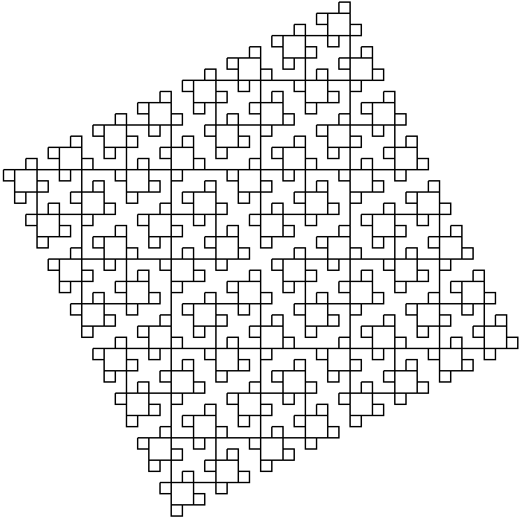

===============================================
 Parameterisation - the most important pattern
===============================================

(This page is a re-worked version of an article that I first wrote for Toptal, and is also on my blog as `A Look at Python, Parameterized <https://lukeplant.me.uk/blog/posts/a-look-at-python-parameterized/>`_)

Probably the most common and important technique for writing Python code is one that you may already have come across and used without thinking. It is one that plays a very important role in Python, where it is a lot more powerful than in some languages, and takes the place of various other “design patterns” that are common in other languages.

For these reasons this post will start with some very simple examples, but
progress to more advanced topics.

.. contents:: Contents

The simplest case
=================

For most of our examples we'll use the instructional standard library `turtle
<https://docs.python.org/3/library/turtle.html>`_ module for doing some
graphics.

Here is some code that will draw a 100x100 square using ``turtle``:

.. code-block:: python

   from turtle import Turtle

   turtle = Turtle()

   for i in range(0, 4):
       turtle.forward(100)
       turtle.left(90)

Suppose we now want to draw a different size square. A very junior programmer at
this point would be tempted to copy and paste this block and modify. Obviously,
a much better method would be to first extract the square drawing code into a
function:

.. code-block:: python
   :emphasize-lines: 5-8

   from turtle import Turtle

   turtle = Turtle()

   def draw_square():
       for i in range(0, 4):
           turtle.forward(100)
           turtle.left(90)

   draw_square()

And then, we pull out the size of the square as parameter:

.. code-block:: python
   :emphasize-lines: 1,3

   def draw_square(size: int):
       for i in range(0, 4):
           turtle.forward(size)
           turtle.left(90)

   draw_square(100)

So we can now draw squares of any size using ``draw_square``. That's all there
is to the essential technique of parameterisation:

- identify the part of a bit of code that you want to make into a variable
- turn it into a parameter of a function or method.

An immediate issue with the code above is that ``draw_square`` depends on a
global variable ``turtle``. This has `lots of bad consequences <http://wiki.c2.com/?GlobalVariablesAreBad>`_, and
there are two easy ways we can fix it. The first would be for ``draw_square`` to
create the ``Turtle`` instance itself (which I'll discuss later), which might
not be desirable if we want to use a single ``Turtle`` for all our drawing. The
other is to simply use parameterisation again to make ``turtle`` a parameter to
``draw_square``:

.. code-block:: python
   :emphasize-lines: 3,9

   from turtle import Turtle

   def draw_square(turtle: Turtle, size: int):
       for i in range(0, 4):
           turtle.forward(size)
           turtle.left(90)

   turtle = Turtle()
   draw_square(turtle, 100)

This has a fancy name - `dependency injection
<https://en.wikipedia.org/wiki/Dependency_injection>`_. It simply means that if
a function needs some kind of object to do its work, like ``draw_square`` needs
a ``Turtle``, the caller is responsible for passing that object in as a
parameter.

So far we've dealt with two very basic usages. The key observation for the rest
of this article is that in Python, there is a large range of things that can
become parameters — more than in some other languages — and this makes it a very
powerful technique.

Anything that is an object
==========================

In Python you can use this technique to parameterise anything that is an object,
and in Python most things you come across are in fact objects. This includes:

* instances of builtin types - like the string ``"I'm a string"`` and the
  integer ``42``, or a dictionary.

* instances of other types and classes e.g. a ``datetime.datetime`` object.

* functions and methods

* builtin types and custom classes.

The last two are the ones that are the most surprising, especially if you are
coming from other languages.

Functions as parameters
=======================

Let's tackle functions first. The function statement in Python does two things:

1. It creates a function object.
2. It creates a name in the local scope that points at that object.

We can play with these objects in a REPL:

.. code-block:: python

   >>> def foo():
   ...     return "Hello from foo"
   >>>
   >>> foo()
   'Hello from foo'
   >>> print(foo)
   <function foo at 0x7fc233d706a8>
   >>> type(foo)
   <class 'function'>
   >>> foo.__name__
   'foo'

And just like all objects, we can assign functions to other variables:

.. code-block:: python

   >>> bar = foo
   >>> bar()
   'Hello from foo'

Note that ``bar`` is another name for the same object, so it has the same
internal ``__name__`` property as before:

.. code-block:: python

   >>> bar.__name__
   'foo'
   >>> bar
   <function foo at 0x7fc233d706a8>

That is, the ``def`` statement created a new function object, and set its internal ``__name__`` property, while the ``bar =`` statement just assigned a new name in the local scope for the same object.

But the crucial point is that because functions are just objects, anywhere you
see a function being used, it could be a parameter. And, any bit of code could be packaged up into a function.

So, suppose we extend our square drawing function above, and now, sometimes when
we draw squares we want to pause at each corner:

.. code-block:: python
   :emphasize-lines: 6

   import time

   def draw_square(turtle: Turtle, size: int):
       for i in range(0, 4):
           turtle.forward(size)
           time.sleep(5)
           turtle.left(90)

But sometimes we don't want to pause. The simplest way to achieve this would be
to add a pause parameter, perhaps with a default of zero so that by default we
don't pause.

However, we later discover that sometimes we actually want to do something
completely different at the corners. Perhaps we want to draw another shape at
each corner, or change the pen colour etc. We might be tempted to add lots more
parameters, one for each thing we need to do. However, a much nicer solution
would be to allow any function to be passed in as the action to take. For a
default, we'll make a function that does nothing. We'll also make this function
accept the local ``turtle`` and ``size`` parameters, in case they are required.

.. code-block:: python
   :emphasize-lines: 5,8,11,18

   from turtle import Turtle
   from typing import Callable
   import time

   def do_nothing(turtle: Turtle, size: int) -> None:
       pass

   def draw_square(turtle: Turtle, size: int, at_corner: Callable[[Turtle, int], None] = do_nothing):
       for i in range(0, 4):
           turtle.forward(size)
           at_corner(turtle, size)
           turtle.left(90)

   def pause(turtle, size):
       time.sleep(5)

   turtle = Turtle()
   draw_square(turtle, 100, at_corner=pause)

Or, we could do something a bit cooler like recursively draw smaller squares at
each corner:

.. code-block:: python

    def smaller_square(turtle, size):
        if size < 10:
            return
        draw_square(turtle, size / 2, at_corner=smaller_square)

    draw_square(turtle, 128, at_corner=smaller_square)

There are of course variations on this. In many examples, the return value of
the function would be used. Here we have a more imperative style of programming,
and the function is called only for its side-effects.

In other languages...
---------------------

Having first class functions in Python makes this very easy. In languages that
lack them, or some statically typed languages that require type signatures for
parameters, this can be harder.

How would we do this if we had no first class functions?

One method would be to turn ``draw_square`` into a class, ``SquareDrawer``:

.. code-block:: python

   class SquareDrawer:
       def __init__(self, size: int):
           self.size = size

       def draw(self, turtle: Turtle) -> None:
           for i in range(0, 4):
               turtle.forward(self.size)
               self.at_corner(turtle, size)
               turtle.left(90)

       def at_corner(self, turtle: Turtle, size: int) -> None:
           pass

Now we can subclass ``SquareDrawer`` and add an ``at_corner()`` method that does
what we need.

This pattern is known as the `template method pattern
<https://en.wikipedia.org/wiki/Template_method_pattern>`_. A base class defines
the shape of the whole operation or algorithm, and the variant portions of the
operation are put into methods that need to be implemented by sub-classes.

While this pattern may sometimes be helpful in Python, pulling out the variant
code into a function that is simply passed as a parameter is often going to be
much simpler.

A second way we might approach this problem in languages without first class
functions is to wrap our functions up as methods inside classes, like this:

.. code-block:: python

   class DoNothing:
       def run(self, turtle: Turtle, size: int):
           pass

  def draw_square(turtle: Turtle, size: int, at_corner=DoNothing()):
       for i in range(0, 4):
           turtle.forward(size)
           at_corner.run(turtle, size)
           t.left(90)

   class Pauser:
       def run(self, turtle, size):
           time.sleep(5)

   draw_square(turtle, 100, at_corner=Pauser())

This is known as the `strategy pattern
<https://en.wikipedia.org/wiki/Strategy_pattern>`_. Again, this is certainly a
valid pattern to use in Python, especially if the strategy class actually has
not just one but a set of related functions. However, often all we really need
is a function and we can `stop writing classes
<https://www.youtube.com/watch?v=o9pEzgHorH0>`_.

Other callables
---------------

In the examples above, I've talked about passing functions into other functions
as parameters. However, everything I wrote was in fact true of any callable
object. Functions are the simplest example, but we can also consider methods.

Suppose we have a list ``foo``:

.. code-block:: python

   foo = [1, 2, 3]

``foo`` now has a whole bunch of methods attached to it, such as ``.append()``
and ``.count()``. These “bound methods” can be passed around and used like
functions:

.. code-block:: python

   >>> foo = [1, 2, 3]
   >>> append_to_foo = foo.append
   >>> append_to_foo(4)
   >>> foo
   [1, 2, 3, 4]

In addition to these instance methods, there other types of callable objects —
class `staticmethods
<https://docs.python.org/3/library/functions.html#staticmethod>`_ and
`classmethods <https://docs.python.org/3/library/functions.html#classmethod>`_,
instances of classes that implement `__call__
<https://docs.python.org/3/reference/datamodel.html#object.__call__>`_, and
classes/types themselves.

Classes as parameters
=====================

In Python, classes are “first class” – they are run-time objects just like dicts
and strings etc. This might seem even more strange than functions being objects,
but thankfully it is actually easier to demonstrate this fact than for
functions.

The class statement you are familiar with is a nice way of creating classes, but
it isn't the only way — we can also use the `3 argument version of type
<https://docs.python.org/3.7/library/functions.html#type>`_. The following two
statements do exactly the same thing:

.. code-block:: python

   class Foo:
       pass

   Foo = type('Foo', (), {})

In the second version, note the two things we just did (which are done more
conveniently using the ``class`` statement):

1. On the right hand side of the equals sign, we created a new class, with an
   internal name of ``'Foo'``. This is the name that you will get back if you do
   ``Foo.__name__``.

2. With the assignment, we then created a name in the current scope, ``Foo``,
   which refers to that class object we just created.

We made the same observations for what the function statement does.

The key insight here is that classes are objects that can be assigned names
(i.e. can be put in a variable). Anywhere that you see a class in use, you are
actually just seeing a variable in use. And if it's a variable, it can be a
parameter.

We can break that down into a number of uses:

Classes are factories
=====================

A class is a callable object that creates an instance of itself:

.. code-block:: python

   >>> class Foo:
   ...    pass
   >>> Foo()
   <__main__.Foo at 0x7f73e0c96780>

And as an object it can be assigned to other variables:

.. code-block:: python

   >>> my_class = Foo
   >>> my_class()
   <__main__.Foo at 0x7f73e0ca93c8>

Going back to our turtle example above, one problem with using turtles for
drawing is that the position and orientation of the drawing depends on the
current position and orientation of the turtle, and it can also leave it in a
different state which might be unhelpful for the caller, which we might not
want. To solve this, our ``draw_square`` function could create its own turtle,
move it to the desired position and then draw a square.

.. code-block:: python
   :emphasize-lines: 2-5

   def draw_square(x: int, y: int, size: int):
       turtle = Turtle()
       turtle.penup()  # Don't draw while moving to the start position
       turtle.goto(x, y)
       turtle.pendown()
       for i in range(0, 4):
           turtle.forward(size)
           turtle.left(90)

However, we now have a customisation problem. Suppose the caller wanted to set
some attributes of the turtle, or use a different kind of turtle that has the
same interface but has some special customisation?

We could solve this with dependency injection, like we had before — the caller
would be responsible for setting up the ``Turtle`` object. But what if our
function sometimes needs to make many turtles for different drawing purposes -
or if perhaps it wants to kick off 4 threads each with its own turtle to draw
one side of the square? The answer is simply to make the ``Turtle`` class a
parameter to the function. We can use a keyword argument with a default value,
so that client code that doesn't care just uses the default:

.. code-block:: python
   :emphasize-lines: 1,2

   def draw_square(x: int, y: int, size: int, make_turtle: Callable[[], Turtle] = Turtle):
       turtle = make_turtle()
       turtle.penup()
       turtle.goto(x, y)
       turtle.pendown()
       for i in range(0, 4):
           turtle.forward(size)
           turtle.left(90)

To use this, we could write a ``make_turtle`` function that creates a turtle and
modifies it. Suppose we want to hide the turtle when drawing squares:

.. code-block:: python

   def make_hidden_turtle() -> Turtle:
       turtle = Turtle()
       turtle.hideturtle()
       return turtle

   draw_square(5, 10, 20, make_turtle=make_hidden_turtle)

Or we could subclass ``Turtle`` to make that behaviour built-in, and pass the
subclass as the parameter:

.. code-block:: python

   class HiddenTurtle(Turtle):
       def __init__(self, *args, **kwargs):
           super().__init__(*args, **kwargs)
           self.hideturtle()

   draw_square(5, 10, 20, make_turtle=HiddenTurtle)

In other languages...
---------------------

Several other OOP languages like Java and C# lack first class classes. To
instantiate a class, you have to use the ``new`` keyword followed by an actual
class name.

This limitation is the reason for patterns like `abstract factory
<https://en.wikipedia.org/wiki/Abstract_factory_pattern>`_ (which requires the
creation of a set of classes whose only job is to instantiate other classes) and
the `Factory Method pattern
<https://python-patterns.guide/gang-of-four/factory-method/>`_. As you can see,
in Python it is just a matter of pulling out the class as a parameter, because a
class is its own factory.

Classes as base classes
-----------------------

The application of parameterisation below is much less common than those above, but it can be useful when you need it.

Suppose we find ourselves creating sub-classes to add the same feature to
different classes. For example, to use our example above, we want a ``Turtle``
subclass that will write out to a log when it is created:

.. code-block:: python

   import logging
   logger = logging.getLogger()

   class LoggingTurtle(Turtle):
       def __init__(self, *args, **kwargs):
           super().__init__(*args, **kwargs)
           logger.debug("Turtle got created")

But then, we find ourselves doing exactly the same thing with another class:

.. code-block:: python

   class LoggingHippo(Hippo):
       def __init__(self, *args, **kwargs):
           super().__init__(*args, **kwargs)
           logger.debug("Hippo got created")

The only things varying between these two are:

1. The base class
2. The name of the sub-class - but we don't really care about that and
   could generate it automatically from the base class ``__name__`` attribute.
3. The name used inside the ``debug`` call — but again we could generate this
   from the base class name.

Faced with two very similar bits of code with only one variant, what can we do?
Just like in our very first example - we create a function and pull out the
variant part as a parameter. The only thing you need to realize is that in the
class statements above, ``Turtle`` and ``Hippo`` are just variables that happen
to refer to class objects. So we can do this:

.. code-block:: python

   def make_logging_class(cls: type):

       class LoggingThing(cls):
           def __init__(self, *args, **kwargs):
               super().__init__(*args, **kwargs)
               logger.debug("{0} got created".format(cls.__name__))

       cls.__name__ = "Logging{0}".format(cls.__name__)
       return cls

   LoggingTurtle = make_logging_class(Turtle)
   LoggingHippo = make_logging_class(Hippo)

Here we have a demonstration of first class classes:

* We passed a class into a function - giving the parameter a conventional name
  ``cls`` to avoid the clash with keyword ``class`` (you will also see
  ``class_`` and ``klass`` used for this purpose).

* Inside the function we made a new class

* We returned that class as the return value of the function.

We also set ``cls.__name__`` which is entirely optional but can help with
debugging.

Another application of this technique is when we have a whole bunch of features
that we sometimes want to add to a class, and we might want to add various
combinations of these features. Manually creating all the different combinations
we need could get very unwieldy.

In languages where classes are created at compile-time rather than run-time,
this isn't possible. Instead, you have to use the `decorator pattern
<https://en.wikipedia.org/wiki/Decorator_pattern>`_. That pattern may be useful
sometimes in Python, but mostly you can just use the technique above.

Normally, I actually avoid creating lots of subclasses for customising. Usually
there are simpler and more Pythonic methods that don't involve classes at all.
But this technique is available if you need it. See also `Brandon Rhodes full
treatment of the decorator pattern in Python
<https://python-patterns.guide/gang-of-four/decorator-pattern/>`_.

Classes as exceptions
---------------------

Another place you see classes being used is in the ``except`` clause of a
try/except/finally statement. No surprises for guessing that we can parameterise
those classes too.

For example, the following code implements a very generic strategy of attempting
an action that could fail, and retrying with exponential backoff until a maximum
number of attempts is reached:

.. code-block:: python

   import time

   def retry_with_backoff(action: Callable,
                          exceptions_to_catch: type[Exception] | tuple[type[Exception], ...],
                          max_attempts: int = 10,
                          attempts_so_far: int = 0):
       try:
           return action()
       except exceptions_to_catch:
           attempts_so_far += 1
           if attempts_so_far >= max_attempts:
               raise
           else:
               time_to_sleep = attempts_so_far ** 2
               print(f"Waiting {time_to_sleep}")
               time.sleep(time_to_sleep)
               return retry_with_backoff(action,
                                         exceptions_to_catch,
                                         attempts_so_far=attempts_so_far,
                                         max_attempts=max_attempts)

We have pulled out both the action to take and the exceptions to catch as
parameters. ``exceptions_to_catch`` can be either a single class, such as
``IOError`` or ``httplib.client.HTTPConnectionError``, or a tuple of such
classes. (We want to avoid bare excepts or even ``except Exception`` because
`this is known to hide other programming errors
<https://stackoverflow.com/a/736029/182604>`_).

Warnings
========

Parameterisation is a powerful technique for re-using code and reducing code
duplication. It is not without some drawbacks. In the pursuit of code re-use,
several problems often surface:

* Overly generic or abstracted code that becomes very difficult to understand.

* Code with a `proliferation of parameters
  <http://smallcultfollowing.com/babysteps/blog/2012/04/11/doa-dont-overabstract/>`_
  that obscures the big picture, or introduces bugs because in reality only
  certain combinations of parameters are properly tested.

* Unhelpful coupling of different parts of the code base because their 'common
  code' has been factored out into a single place. Sometimes code in two places
  is similar only accidentally, and the two places should be independent from
  each other because `they may need to change independently
  <http://verraes.net/2014/08/dry-is-about-knowledge/>`_.

Sometimes a bit of 'duplicated' code is far better than these problems, so use
this technique with care.

